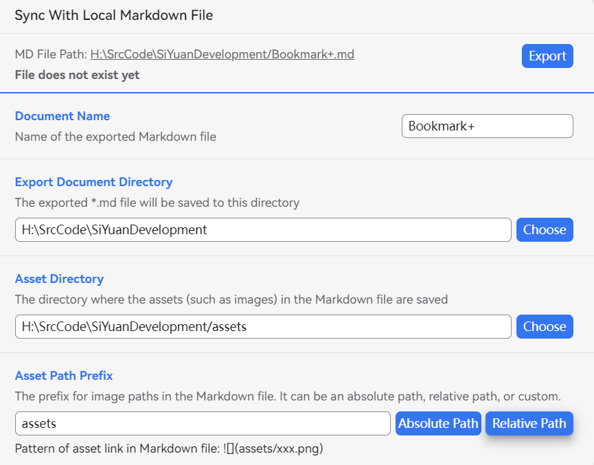
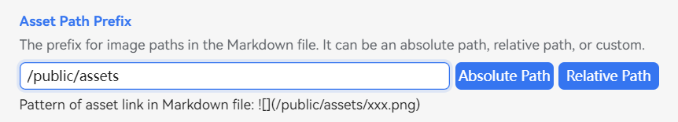
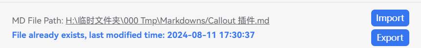
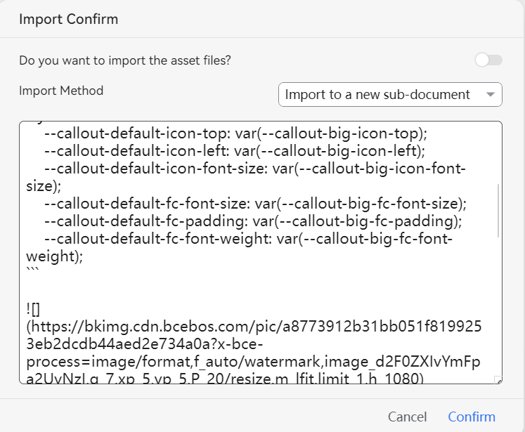

This plugin establishes a bidirectional binding relationship between a SiYuan document and a local markdown file. You can:

* Export a document from SiYuan to a local md file
* Import content from a local md file into SiYuan

⚠️ Note: This plugin <u>only supports use in desktop environments and does not support mobile or web versions</u>.

## Configure Binding Relationship

Click on the block menu of a document and configure the local MD file bound to the document in the dialog box.

​​

* **Document Name**: The name of the bound file
* **Export Document Directory**: The directory where the exported markdown file will be placed
* **Resource File Directory**: The directory where the resource files used in the document, such as images, will be placed

  * The default is the `assets`​ folder under the document directory
* **Asset Path Prefix**: The prefix for the resource files referenced in the exported Markdown file; you can specify whether to use an absolute or relative path by clicking the two buttons on the right; in special cases, you can also fill it in manually (do not add `/`​ or `\`​ symbols at the end of the prefix)

## Export File

Click the export button to automatically write the content of the SiYuan document into the md file and write all asset files into the resource file directory.

### About "Asset Path Prefix"

The "Asset Path Prefix" field generally does not need special configuration. In most cases, simply click the "Absolute Path" or "Relative Path" button.

💡 However, in some special cases, users need to manually fill in the prefix.

For example: When using document frameworks based on markdown like VitePress, the routes to resource files in the md file often do not point to the actual local paths—in the local file system, the "Resource File Directory" and the paths to resource files referenced in the markdown may not be the same.

Here is a simple example:

​​

And the links within markdown file will be like this:

​​

## Import File

> ⚠️ Note: The import function completely overwrites the original document, which will cause block IDs to change, resulting in the invalidation of external references to blocks within the document!

If the specified markdown file already exists, you can also choose to import the file.

​​

For safety reasons, when importing a file, you need to manually configure the import options:

​​

* **Import Asset Files**

  * The default is No, which means that files such as images will not be uploaded to the SiYuan workspace

    * First, check if the resource files already exist in SiYuan. If they do, the internal SiYuan file links will be used.
    * Otherwise, a `file:///`​ protocol link will be used to point to the local file.
  * If Yes is selected, the resource files in the markdown file will be uploaded to SiYuan. Note: All uploaded SiYuan files will be assigned a unique ID, so they will not overwrite existing resource files in SiYuan.
* **Import Method**

  * **Import to a new sub-document**: This will create a sub-document to store the imported content, without affecting the content of the current document.
  * **Overwrite the current document**: This will directly overwrite the content of the current document. Data security is paramount, so proceed with caution!
