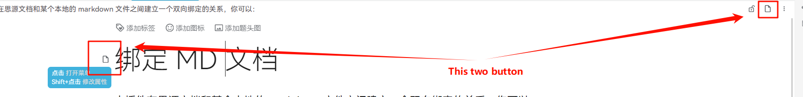
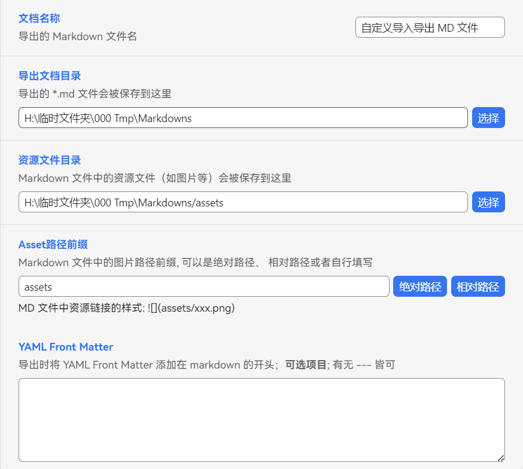
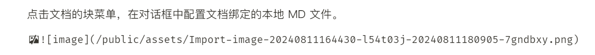
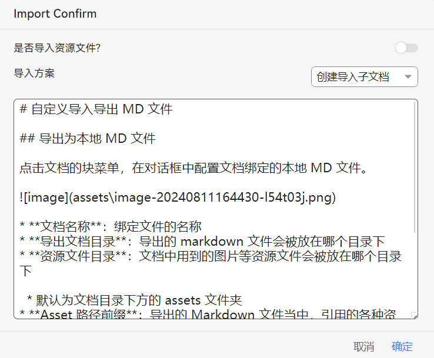

本插件在思源文档和某个本地的 markdown 文件之间建立一个双向绑定的关系，你可以：

* 将思源中的文档导出到本地的 md 文件中
* 将本地的 md 文件内容导入到思源中

⚠️ 注：本插件<u>只支持在桌面环境下使用，不支持移动端、 网页端</u>。

## 配置绑定关系

点击文档的块图标，打开文档的插件菜单。

​​

在对话框中配置文档绑定的本地 MD 文件。

​​

* **文档名称**：绑定文件的名称
* **导出文档目录**：导出的 markdown 文件会被放在哪个目录下
* **资源文件目录**：文档中用到的图片等资源文件会被放在哪个目录下

  * 默认为文档目录下方的 assets 文件夹
* **Asset 路径前缀**：导出的 Markdown 文件当中，引用的各种资源文件的前缀；可以通过点击右侧的两个按钮指定使用绝对路径还是相对路径；特殊情况下也可以自己填写（后缀的位置不要添加 `/`​ 或者 `\`​ 符号）

### 模板管理

​​

* 保存为模板：将当前的配置保存为模板，方便后续使用
* 管理模板：查看所有的模板信息，对每一条模板可以

  * 应用：将对应的模板配置应用到当前的配置中
  * 删除：删除保存的模板

⚠️ 注意：各个设备之前保存的模板互相独立。

## 导出文件

点击导出按钮，会自动将思源的文档内容写入到 md 文件中，并将所有 asset 文件写入到资源文件目录下。

### 关于「Asset路径前缀」

「Asset路径前缀」字段一般无需特别配置。大部分情况下，直接点击「绝对路径」或者「相对路径」按钮即可。

💡 不过在某些特殊情况下，需要用户自己手动填写前缀名称。

例如：在使用 vitepress 这类基于 markdown 的文档框架的时候，md 文件内资源文件的路由往往不指向真实的本地路径——即，在本地文件系统中「资源文件目录」和 markdown 中资源文件指向的路径并不一致。

以下是一个简单的案例：

​​

​​

## 导入文件

> ⚠️ 注意: 导入功能是完全覆盖原文的文档，会造成块 ID 的改变从而造成外部对文档内块引用的失效！

如果指定的 markdown 文件已经存在，那么还可以选择导入文件。

​​

处于安全考虑，导入一个文件的时候，需要手动配置导入方案：

​​

* **是否导入资源文件**

  * 默认为否，不会把图片等文件上传到思源的工作空间中

    * 首先检查资源文件是否已经在思源中存在，如果已经存在，则使用思源内部的文件链接
    * 否则会使用 `file:///`​ 协议链接指向本地的文件
  * 如果选择为是，则会将 markdown 中的资源文件上传到思源当中；注意：上传的所有思源文件都会附上唯一的 ID，故而并不会覆盖思源中原本的资源文件
* **导入方案**

  * 创建导入文件：会创建一个子文档存放导入的内容，不会影响当前文档的内容。
  * 覆盖内容：会直接覆盖当前文档的内容。数据安全最重要，请慎重！

‍
